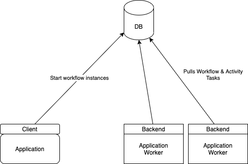
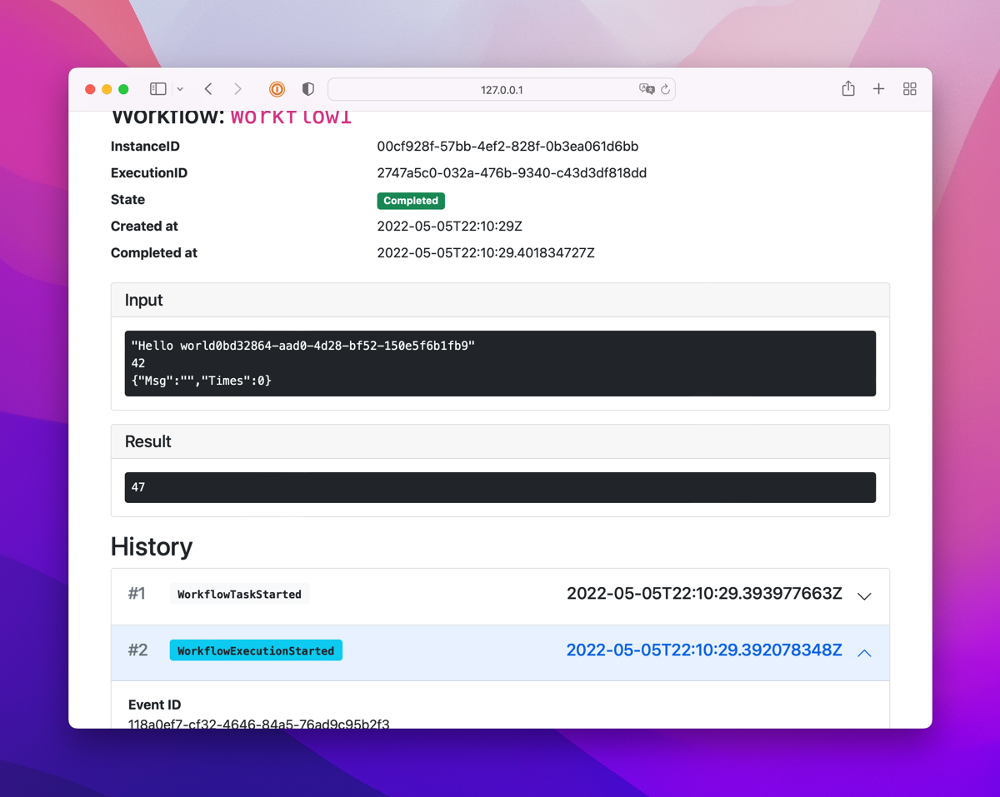

# Durable workflows using Go

[](https://github.com/cschleiden/go-workflows/actions/workflows/go.yml)

Borrows heavily from [Temporal](https://github.com/temporalio/temporal) (and since it's a fork also [Cadence](https://github.com/uber/cadence)) as well as [DTFx](https://github.com/Azure/durabletask).

See also:
- https://cschleiden.dev/blog/2022-02-13-go-workflows-part1/
- https://cschleiden.dev/blog/2022-05-02-go-workflows-part2/

On Go support: the current version of the library requires **Go 1.18** or later. There is a version that doesn't require generics and relies more on `interface{}` instead, but I think the improved type safety is worth not supporting a version of Go before 1.18 for now.

## Simple example

### Workflow

Workflows are written in Go code. The only exception is they must not use any of Go's non-deterministic features (`select`, iteration over a `map`, etc.). Inputs and outputs for workflows and activities have to be serializable:

```go
func Workflow1(ctx workflow.Context, input string) error {
	r1, err := workflow.ExecuteActivity[int](ctx, workflow.DefaultActivityOptions, Activity1, 35, 12).Get(ctx)
	if err != nil {
		panic("error getting activity 1 result")
	}

	log.Println("A1 result:", r1)

	r2, err := workflow.ExecuteActivity[int](ctx, workflow.DefaultActivityOptions, Activity2).Get(ctx)
	if err != nil {
		panic("error getting activity 1 result")
	}

	log.Println("A2 result:", r2)

	return nil
}
```

### Activities

Activities can have side-effects and don't have to be deterministic. They will be executed only once and the result is persisted:

```go
func Activity1(ctx context.Context, a, b int) (int, error) {
	return a + b, nil
}

func Activity2(ctx context.Context) (int, error) {
	return 12, nil
}

```

### Worker

The worker is responsible for executing `Workflows` and `Activities`, both need to be registered with it.

```go
func runWorker(ctx context.Context, mb backend.Backend) {
	w := worker.New(mb, nil)

	r.RegisterWorkflow(Workflow1)

	w.RegisterActivity(Activity1)
	w.RegisterActivity(Activity2)

	if err := w.Start(ctx); err != nil {
		panic("could not start worker")
	}
}
```

### Backend

The backend is responsible for persisting the workflow events. Currently there is an in-memory backend implementation for testing, one using [SQLite](http://sqlite.org), one using MySql, and one using Redis.

```go
b := sqlite.NewSqliteBackend("simple.sqlite")
```

### Putting it all together

We can start workflows from the same process the worker runs in -- or they can be separate. Here we use the SQLite backend, spawn a single worker (which then executes both `Workflows` and `Activities`), and then start a single instance of our workflow

```go
func main() {
	ctx := context.Background()

	b := sqlite.NewSqliteBackend("simple.sqlite")

	go runWorker(ctx, b)

	c := client.New(b)

	wf, err := c.CreateWorkflowInstance(ctx, client.WorkflowInstanceOptions{
		InstanceID: uuid.NewString(),
	}, Workflow1, "input-for-workflow")
	if err != nil {
		panic("could not start workflow")
	}

	c2 := make(chan os.Signal, 1)
	signal.Notify(c2, os.Interrupt)
	<-c2
}
```

## Architecture (WIP)

The high-level architecture follows the same model as Azure's [DurableTask](https://github.com/Azure/durabletask) library. The "persistence store" or "providers" mentioned there are implementations of `backend.Backend` for `go-workflows`. There is no intermediate server, clients which create new workflow instances and retrieve their results, as well as worker processes (which could also be the same as clients), talk directly to the backend. For the two implemented backends so far, that also means directly to the database.



### Execution model

While there are implementations for other lanuages in the context of Azure Durable Functions, the general purpose version of Durable Task was only implemented for C#.

The execution model for `go-workflows` follows closely the one created for Uber's [Cadence](https://cadenceworkflow.io) and which was then forked by the original creators for [Temporal.io](https://temporal.io).

See https://cschleiden.dev/blog/2022-05-02-go-workflows-part2/ for some more details.

### Supported backends

For all backends, for now the initial schema is applied upon first usage. In the future this might move to something more powerful to migrate between versions, but in this early stage, there is no upgrade.

#### Sqlite

The Sqlite backend implementation supports two different modes, in-memory and on-disk.

 * In-memory:
	```go
	b := sqlite.NewInMemoryBackend()
	```
 * On-disk:
	```go
	b := sqlite.NewSqliteBackend("simple.sqlite")
	```

#### MySql

```go
b := mysql.NewMysqlBackend("localhost", 3306, "root", "SqlPassw0rd", "simple")
```

#### Redis

```go
b, err := redis.NewRedisBackend("localhost:6379", "user", "RedisPassw0rd", 0)
if err != nil {
	panic(err)
}

```

## Guide

### Registering workflows

Workflows need to accept `workflow.Context` as their first parameter, and any number of inputs parameters afterwards. Parameters need to be serializable (e.g., no `chan`s etc.). Workflows need to return an `error` and optionally one additional result, which again needs to be serializable.

```go
func Workflow1(ctx workflow.Context) error {
}
```

Workflows needs to be registered with the worker before they can be started:

```go
var b backend.Backend
w := worker.New(b)

w.RegisterWorkflow(Workflow1)
```

### Registering activities

Similar to workflows, activities need to be registered with the worker before they can be started. They also need to accept `context.Context` as their first parameter, and any number of inputs parameters afterwards. Parameters need to be serializable (e.g., no `chan`s etc.). Activities need to return an `error` and optionally one additional result, which again needs to be serializable.

Activites can be registered as plain `func`s or as methods on a struct. The latter is useful if you want to provide some shared state to activities, for example, a database connection.

```go
func Activity1(ctx context.Context, a, b int) (int, error) {
	return a + b, nil
}
```

```go
var b backend.Backend
w := worker.New(b)

w.RegisterActivity(Activity1)
```

And using a `struct`:

```go
type act struct {
	SharedState int
}

func (a *act) Activity1(ctx context.Context, a, b int) (int, error) {
	return a + b + act.SharedState, nil
}

func (a *act) Activity2(ctx context.Context, a int) (int, error) {
	return a * act.SharedState, nil
}
```

```go
var b backend.Backend
w := worker.New(b)

w.RegisterActivity(&act{SharedState: 12})
```

to call activities registered on a struct from a workflow:

```go
// ...
var a *act

r1, err := workflow.ExecuteActivity[int](ctx, workflow.DefaultActivityOptions, a.Activity1, 35, 12).Get(ctx)
if err != nil {
	// handle error
}
// Output r1 = 47 + 12 (from the worker registration) = 59
```

### Starting workflows

`CreateWorkflowInstance` on a client instance will start a new workflow instance. Pass options, a workflow to run, and any inputs.

```go
wf, err := c.CreateWorkflowInstance(ctx, client.WorkflowInstanceOptions{
	InstanceID: uuid.NewString(),
}, Workflow1, "input-for-workflow")
if err != nil {
	// ...
}
```

### Removing workflow instances

`RemoveWorkflowInstance` on a client instance will remove that workflow instance including all history data from the backend. A workflow instance needs to be in the finished state before calling this, otherwise an error will be returned.

```go
err = c.RemoveWorkflowInstance(ctx, workflowInstance)
if err != nil {
	// ...
}
```

### Canceling workflows

Create a `Client` instance then then call `CancelWorkflow` to cancel a workflow. When a workflow is canceled, it's workflow context is canceled. Any subsequent calls to schedule activities or sub-workflows will immediately return an error, skipping their execution. Any activities already running when a workflow is canceled will still run to completion and their result will be available.

Sub-workflows will be canceled if their parent workflow is canceled.

```go
var c client.Client
err = c.CancelWorkflowInstance(context.Background(), workflowInstance)
if err != nil {
	panic("could not cancel workflow")
}
```

#### Perform any cleanup

If you need to run any activities or make calls using `workflow.Context` you need to create a new context with `workflow.NewDisconnectedContext`, since the original context is canceled at this point.

```go
func Workflow2(ctx workflow.Context, msg string) (string, error) {
	defer func() {
		if errors.Is(ctx.Err(), workflow.Canceled) {
			// Workflow was canceled. Get new context to perform any cleanup activities
			ctx := workflow.NewDisconnectedContext(ctx)

			// Execute the cleanup activity
			if err := workflow.ExecuteActivity(ctx, ActivityCleanup).Get(ctx, nil); err != nil {
				return errors.Wrap(err, "could not perform cleanup")
			}
		}
	}()

	r1, err := workflow.ExecuteActivity[int](ctx, ActivityCancel, 1, 2).Get(ctx)
	if err != nil {  // <---- Workflow is canceled while this activity is running
		return errors.Wrap(err, "could not get ActivityCancel result")
	}

	// r1 will contain the result of ActivityCancel
	// ⬇ ActivitySkip will be skipped immediately
	r2, err := workflow.ExecuteActivity(ctx, ActivitySkip, 1, 2).Get(ctx)
	if err != nil {
		return errors.Wrap(err, "could not get ActivitySkip result")
	}

	return "some result", nil
}
```

### Running activities

From a workflow, call `workflow.ExecuteActivity` to execute an activity. The call returns a `Future[T]` you can await to get the result or any error it might return.

```go
r1, err := workflow.ExecuteActivity[int](ctx, Activity1, 35, 12, nil, "test").Get(ctx)
if err != nil {
	panic("error getting activity 1 result")
}

log.Println(r1)
```

#### Canceling activities

Canceling activities is not supported at this time.

### Timers

You can schedule timers to fire at any point in the future by calling `workflow.ScheduleTimer`. It returns a `Future` you can await to wait for the timer to fire.

```go
t := workflow.ScheduleTimer(ctx, 2*time.Second)
err := t.Get(ctx, nil)
```

#### Canceling timers

There is no explicit API to cancel timers. You can cancel a timer by creating a cancelable context, and canceling that:

```go
tctx, cancel := workflow.WithCancel(ctx)
t := workflow.ScheduleTimer(tctx, 2*time.Second)

// Cancel the timer
cancel()
```

### Signals

Signals are a way to send a message to a workflow. You can send a signal to a workflow by calling `workflow.Signal` and listen to them by creating a `SignalChannel` via `NewSignalChannel`:

```go
// From outside the workflow:
c.SignalWorkflow(ctx, "<instance-id>", "signal-name", "value")

func Workflow(ctx workflow.Context) error {
	// ...

	signalCh := workflow.NewSignalChannel[string](ctx, "signal-name")

	// Pause workflow until signal is received
	workflow.Select(ctx,
		workflow.Receive(signalCh, func(ctx workflow.Context, r string, ok bool) {
			logger.Debug("Received signal:", r)
		}),
	)

	// Continue execution
}
```

#### Signaling workflows from within workflows

```go
func Workflow(ctx workflow.Context) error {
	if _, err := workflow.SignalWorkflow(ctx, "sub-instance-id", "signal-name", "value").Get(ctx); err != nil {
		// Handle error
	}
}
```

### Executing side effects

Sometimes scheduling an activity is too much overhead for a simple side effect. For those scenarios you can use `workflow.SideEffect`. You can pass a func which will be executed only once inline with its result being recorded in the history. Subsequent executions of the workflow will return the previously recorded result.

```go
id, _ := workflow.SideEffect[string](ctx, func(ctx workflow.Context) string) {
	return uuid.NewString()
}).Get(ctx)
```

### Running sub-workflows

Call `workflow.CreateSubWorkflowInstance` to start a sub-workflow. The returned `Future` will resolve once the sub-workflow has finished.

```go
func Workflow1(ctx workflow.Context, msg string) error {
	result, err := workflow.CreateSubWorkflowInstance[int]
		ctx, workflow.SubWorkflowInstanceOptions{}, SubWorkflow, "some input").Get(ctx)
	if err != nil {
		return errors.Wrap(err, "could not get sub workflow result")
	}

	logger.Debug("Sub workflow result:", "result", result)

	return nil
}

func SubWorkflow(ctx workflow.Context, msg string) (int, error) {
	r1, err := workflow.ExecuteActivity[int](ctx, Activity1, 35, 12).Get(ctx)
	if err != nil {
		return "", errors.Wrap(err, "could not get activity result")
	}

	logger.Debug("A1 result:", "r1", r1)
	return r1, nil
}
```

#### Canceling sub-workflows

Similar to timer cancellation, you can pass a cancelable context to `CreateSubWorkflowInstance` and cancel the sub-workflow that way. Reacting to the cancellation is the same as canceling a workflow via the `Client`. See [Canceling workflows](#canceling-workflows) for more details.


### `select`

Due its non-deterministic behavior you must not use a `select` statement in workflows. Instead you can use the provided `workflow.Select` function. It blocks until one of the provided cases is ready. Cases are evaluated in the order passed to `Select.

```go
var f1 workflow.Future[int]
var c workflow.Channel[int]

value := 42

workflow.Select(
	ctx,
	workflow.Await(f1, func (ctx workflow.Context, f Future[int]) {
		r, err := f.Get(ctx)
		// ...
	}),
	workflow.Receive(c, func (ctx workflow.Context, v int, ok bool) {
		// use v
	}),
	workflow.Send(c, &value, func (ctx workflow.Context) {
		// value has been sent to the channel
	}),
	workflow.Default(ctx, func (ctx workflow.Context) {
		// ...
	})
)
```

#### Waiting for a Future

`Await` adds a case to wait for a Future to have a value

```go
var f1, f2 workflow.Future[int]

workflow.Select(
	ctx,
	workflow.Await(f1, func (ctx workflow.Context, f Future[int]) {
		r, err := f.Get(ctx)
		// ...
	}),
	workflow.Await(f2, func (ctx workflow.Context, f Future[int]) {
		r, err := f.Get(ctx)
		// ...
	}),
)
```

#### Waiting to receive from a Channel

`Receive` adds a case to receive from a given channel

```go
var c workflow.Channel[int]

workflow.Select(
	ctx,
	workflow.Receive(c, func (ctx workflow.Context, v int, ok bool) {
		// ...
	}),
)
```

#### Default/Non-blocking

A `Default` case is executed if no previous case is ready and selected:

```go
var f1 workflow.Future[int]

workflow.Select(
	ctx,
	workflow.Await(f1, func (ctx workflow.Context, f Future[int]) {
		r, err := f.Get(ctx, &r)
		// ...
	}),
	workflow.Default(ctx, func (ctx workflow.Context) {
		// ...
	})
)
```

### Unit testing

#### Workflows

go-workflows includes support for testing workflows, a simple example using mocked activities:

```go
func TestWorkflow(t *testing.T) {
	tester := tester.NewWorkflowTester[int](Workflow1)

	// Mock two activities
	tester.OnActivity(Activity1, mock.Anything, 35, 12).Return(47, nil)
	tester.OnActivity(Activity2, mock.Anything, mock.Anything, mock.Anything).Return(12, nil)

	// Run workflow with inputs
	tester.Execute("Hello world")

	// Workflows always run to completion, or time-out
	require.True(t, tester.WorkflowFinished())

	wr, werr := tester.WorkflowResult()
	require.Equal(t, 59, wr)
	require.Empty(t, werr)

	// Ensure any expectations set for activity or sub-workflow mocks were met
	tester.AssertExpectations(t)
}
```

- Timers are automatically fired by advancing a mock workflow clock that is used for testing workflows
- You can register callbacks to fire at specific times (in mock-clock time). Callbacks can send signals, cancel workflows etc.

#### Activities

Activities can be tested like any other function. If you make use of the activity context, for example, to retrieve a logger, you can use `activitytester.WithActivityTestState` to provide a test activity context. If you don't specify a logger, the default logger implementation will be used.


```go
func Activity(ctx context.Context, a int, b int) (int, error) {
	activity.Logger(ctx).Debug("Activity is called", "a", a)

	return a + b, nil
}

func TestActivity(t *testing.T) {
	ctx := activitytester.WithActivityTestState(context.Background(), "activityID", "instanceID", nil)

	r, err := Activity(ctx, 35, 12)
	require.Equal(t, 47, r)
	require.NoError(t, err)
}
```

### Logging

For logging, you can pass a type to the backend via the `WithLogger` option to set a custom logger. The type has to implement this simple interface:

```go
type Logger interface {
	Debug(msg string, fields ...interface{})
	Warn(msg string, fields ...interface{})
	Error(msg string, fields ...interface{})
	Panic(msg string, fields ...interface{})

	With(fields ...interface{}) Logger
}
```

If you don't pass a logger, a very simple, unoptimized default logger is used. For production use it is strongly recommended to pass another logger.

#### Workflows

For logging in workflows, you can get a logger using

```go
logger := workflow.Logger(ctx)
```

The returned `logger` implements the `Logger` interface, and already has the workflow instance and execution IDs set as default fields.

#### Activities

For logging in activities, you can get a logger using

```go
logger := activity.Logger(ctx)
```

The returned `logger` implements the `Logger` interface, and already has the id of the activity, and the workflow instance and execution IDs set as default fields.

### Tracing

The library supports tracing via [OpenTelemetry](https://opentelemetry.io/). When you pass a `TracerProvider` when creating a backend instance, workflow execution will be traced. You can also add additional spans for both activities and workflows.

_Note: the support is considered experimental right now, if you decide to use it, please leave feedback_

#### Activities

The `context.Context` passed into activities is set up with the correct current span. If you create additional spans, they'll show up under the `ActivityTaskExecution`:

```go
func Activity1(ctx context.Context, a, b int) (int, error) {
	ctx, span := otel.Tracer("activity1").Start(ctx, "Custom Activity1 span")
	defer span.End()

	// Do something
}
```

#### Workflows

For workflows the usage is a bit different, the tracer needs to be aware of whether the workflow is being replayed or not:

```go
func Workflow(ctx workflow.Context) error {
	ctx, span := workflow.Tracer(ctx).Start(ctx, "Workflow1 span", trace.WithAttributes(
		// Add additional
		attribute.String("msg", "hello world"),
	))

	// Do something

	span.End()
```

## Tools

### Analyzer

`/analyzer` contains a simple [golangci-lint](https://github.com/golangci/golangci-lint) based analyzer to spot common issues in workflow code.

### Diagnostics Web UI

For investigating workflows, the package includes a simple diagnostic web UI. You can serve it via:

```go
m := http.NewServeMux()
m.Handle("/diag/", http.StripPrefix("/diag", diag.NewServeMux(b)))
go http.ListenAndServe(":3000", m)
```

It provides a simple paginated list of workflow instances:


And a way to inspect the history of a workflow instance:



## FAQ

### How are releases versioned?

For now this library is in a pre-release state. There are no guarantees given regarding breaking changes between (pre)-releases.

### Workflow versioning

For now, I've intentionally left out versioning. Cadence, Temporal, and DTFx all support the concept of versions for workflows as well as activities. This is mostly required when you make changes to workflows and need to keep backwards compatibility with workflows that are being executed at the time of the upgrade.

**Example**: when you change a workflow from:

```go
func Workflow1(ctx workflow.Context) {
	r1, _ := workflow.ExecuteActivity[int](ctx, workflow.DefaultActivityOptions, Activity1, 35, 12).Get(ctx)
	log.Println("A1 result:", r1)

	r2, _ := workflow.ExecuteActivity[int](ctx, workflow.DefaultActivityOptions, Activity2).Get(ctx)
	log.Println("A2 result:", r2)
}
```

to:

```go
func Workflow1(ctx workflow.Context) {
	var r1 int
	r1, _ := workflow.ExecuteActivity[int](ctx, workflow.DefaultActivityOptions, Activity1, 35, 12).Get(ctx)
	log.Println("A1 result:", r1)

	r3, _ := workflow.ExecuteActivity[int](ctx, workflow.DefaultActivityOptions, Activity3).Get(ctx)
	log.Println("A3 result:", r3)

	r2, _ := workflow.ExecuteActivity[int](ctx, workflow.DefaultActivityOptions, Activity2).Get(ctx)
	log.Println("A2 result:", r2)
}
```

and you replay a workflow history that contains:

1. `ActivitySchedule` - `Activity1`
1. `ActivityCompleted` - `Activity1`
1. `ActivitySchedule` - `Activity2`
1. `ActivityCompleted` - `Activity2`

the workflow will encounter an attempt to execute `Activity3` in-between event 2 and 3, for which there is no matching event. This is a non-recoverable error. The usual approach to solve is to version the workflows and every time you make a change to a workflow, you have to check that logic. For this example this could look like:


```go
func Workflow1(ctx workflow.Context) {
	r1, _ := workflow.ExecuteActivity[int](ctx, workflow.DefaultActivityOptions, Activity1, 35, 12).Get(ctx)
	log.Println("A1 result:", r1)

	if workflow.Version(ctx) >= 2 {
		r3, _ := workflow.ExecuteActivity(ctx, workflow.DefaultActivityOptions, Activity3).Get(ctx)
		log.Println("A3 result:", r3)
	}

	r2, _ := workflow.ExecuteActivity[int](ctx, workflow.DefaultActivityOptions, Activity2).Get(ctx)
	log.Println("A2 result:", r2)
}
```

and only if a workflow instance was created with a version of `>= 2` will `Activity3` be executed. Older workflows are persisted with a version `< 2` and will not execute `Activity3`.

This kind of check is understandable for simple changes, but it becomes hard and a source of bugs for more complicated workflows. Therefore for now versioning is not supported and the guidance is to rely on **side-by-side** deployments. See also Azure's [Durable Functions](https://docs.microsoft.com/en-us/azure/azure-functions/durable/durable-functions-versioning) documentation for the same topic.

### `ContinueAsNew`

Both Temporal/Cadence and DTFx support `ContinueAsNew`. This essentially re-starts a running workflow as a new workflow with a new event history. This is needed for long running workflows where the history can become very large, negatively affecting performance. This feature is not implemented in go-workflows.
