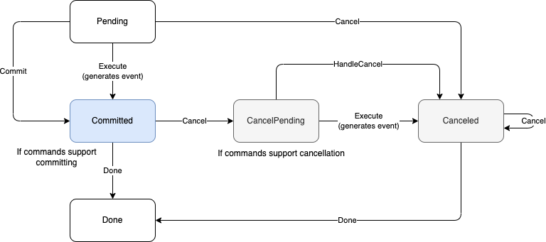

# Commands

Commands encode decisions during the workflow execution. When a workflow like

```go
func Workflow(ctx workflow.Context) error {
  _, err := workflow.ExecuteActivity(ctx, "Activity1").Get(ctx, nil)

  return err
}
```

is executed for the first time, a `ScheduleActivity` command is tracked and when the workflow reaches a checkpoint (it yields), this command is `Execute`d, and resulting `EventType_ActivityScheduled` event is processed by the backend. When the workflow is replayed, the command is also generated, but once the workflow reaches a checkpoint and history events are replayed, it is marked as `Committed` since we already have the `EventType_ActivityScheduled` message in the history.

This will cause the command to **not** produce another event when the workflow yields again. Other operations are implemented in a similar way.


## States & Transitions

Commands are a simpel state machine and their states and transitions are the following:



- Not all commands are cancelable. The ones which are are:
  - ScheduleSubWorkflow
  - ScheduleTimer

- No all commands are committable, the ones which aren't are:
  - Sideeffect